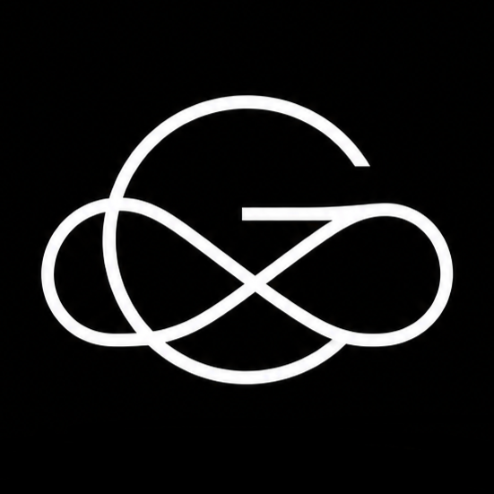

<p align="center">
  
</p>

<h1 align="center">Giri Orbit — Sovereign Office Productivity Platform</h1>

<p align="center">
  <strong>Next-Generation Sovereign Office Suite Engineered for Absolute Privacy and Enterprise Velocity.</strong><br>
  By <a href="https://giri-corporation.pages.dev/"><strong>GIRI Corporation</strong></a> (A Subsidiary of Giri Group)
</p>

<p align="center">
  <a href="https://giri-orbit.pages.dev/"></a>
  
  
  
</p>

---

## 🚀 Live Deployment

The official production environment is actively deployed on Cloudflare Pages:
👉 **[https://giri-orbit.pages.dev/](https://giri-orbit.pages.dev/)**

---

## 🔒 Proprietary License & Terms of Use (STRICTLY RESTRICTED)

> ### ⚠️ COPYRIGHT & USAGE NOTICE: ALL RIGHTS RESERVED
> 
> **Copyright © 2025–2026 GIRI Corporation (Giri Group). All Rights Reserved.**
>
> This repository and all associated software, source code, designs, user interfaces, documentation, graphic marks, algorithms, and intellectual assets are the **exclusive proprietary property of GIRI Corporation**.
>
> **Strict Terms & Restrictions:**
> 1. **No External or Unauthorized Use**: You may NOT copy, reproduce, distribute, publicly display, sublicense, decompile, reverse-engineer, modify, or create derivative works from any part of this software or its source code.
> 2. **No Commercial or Non-Commercial Exploitation**: External individuals, organizations, or third parties are strictly prohibited from using, hosting, redistributing, or incorporating any component of this platform into other products or services.
> 3. **Private Sovereign Technology**: Access to this repository is provided solely for internal inspection and authorized development by GIRI Corporation. No license or permission, express or implied, is granted under any patent, copyright, trademark, or trade secret rights of GIRI Corporation.
>
> *For licensing inquiries or authorized institutional partnerships, contact GIRI Corporation at `giricorporationpvt@gmail.com`.*

---

## ✨ The Giri Orbit Suite

Giri Orbit delivers an end-to-end office productivity experience that executes **entirely client-side in the browser** — with sub-millisecond document discovery, zero outbound telemetry leaks, and complete independence from central servers.

```
┌────────────────────────────────────────────────────────────────────────┐
│                          GIRI ORBIT PLATFORM                           │
├───────────────┬────────────────┬───────────────────┬───────────────────┤
│  Giri Drift   │   Giri Axis    │   Giri Kinetic    │    Giri Aegis     │
│ (Word Studio) │  (Sheet Calc)  │  (Slide Show UX)  │   (PDF Studio)    │
└───────────────┴────────────────┴───────────────────┴───────────────────┘
        │                │                 │                   │
        └────────────────┴────────┬────────┴───────────────────┘
                                  │
         ┌────────────────────────┴────────────────────────┐
         │  • Universal File Converter (15+ Formats)       │
         │  • Google Drive Cloud Sync ("Continue with G")  │
         │  • Girionix Pro AI Contextual Copilot           │
         │  • Zero-Gravity Physics Recent Docs Matrix      │
         └─────────────────────────────────────────────────┘
```

### 1. 📄 Giri Drift — Authentic Multi-Page Word Processor
- **Physical Sheet Architecture**: Authentic Microsoft Word-style $816\text{px} \times 1056\text{px}$ ($8.5" \times 11"$) pages with authentic margins, subtle elevation shadow, and page separators.
- **Dynamic Auto-Pagination**: Natural paragraph and word-boundary flow from Page 1 to Page 2, Page 3, and beyond without text cutting off or disappearing.
- **1-Click Page Management**: Dedicated "+ Add Page" canvas bar, sidebar navigation miniatures, and <kbd>Ctrl</kbd>+<kbd>Enter</kbd> page break shortcuts.
- **Office Features**: Multi-level headings, Table of Contents generator, Mail Merge with customizable recipients, dynamic watermarking, voice dictation, and print formatting.
- **Native Formats**: Export and import `.gdrift`, `.docx`, `.odt`, `.rtf`, `.md`, `.txt`, `.html`, `.pdf`, `.epub`.

### 2. 📊 Giri Axis — Intelligent High-Speed Spreadsheet
- **Formula & Math Engine**: Real-time evaluation of `SUM`, `AVERAGE`, `VLOOKUP`, `IF`, `COUNTIF`, and financial functions.
- **Data Matrix**: Clean Excel-style formula bar, name box, cell range selections, and live statistical summaries.
- **Data Import & Export**: Full interoperability with `.xlsx`, `.gaxis`, `.csv`, `.tsv`, `.json`.

### 3. 📽️ Giri Kinetic — Executive Slide Presentation Studio
- **Fluent Office Ribbon**: Comprehensive Home, Insert, Review, Design, and Transitions ribbon suites.
- **Visual Diagram Components**: Interactive circular loops, chevron flows, SWOT matrices, pyramid hierarchies, and funnel charts.
- **Media & Tables**: Built-in 8×8 interactive table picker, live SVG bar/line/pie charts, WordArt generator, equation editor, and date/slide stamps.
- **Presenter Mode**: Full-screen slide presentation engine with keyboard navigation and slide thumbnail sorter.
- **Slide Deck Formats**: Supports `.pptx`, `.gkinetic`, `.pdf`, `.html` presentation decks.

### 4. 📑 Giri Aegis — Enterprise PDF Studio
- **PDF Viewing & Annotations**: Built-in PDF reader with page controls, zoom scaling, and signature stamps.
- **Security & Redaction**: Client-side document stamping, digital signatures, and privacy redaction.
- **Export**: Generates `.pdf` and native `.gaegis` containers.

### 5. ☁️ Google Drive Cloud Sync
- **Standard Google Identity**: Pixel-perfect "Continue with Google" sign-in card.
- **1-Click Frictionless Connect**: Integrates directly with Google Identity Services (GIS) OAuth or sovereign local session persistence.
- **Full File Management**: Search, filter, edit, save, and auto-sync documents directly to Google Drive folders from within Orbit.

### 6. ⚡ Girionix Pro AI Copilot
- Integrated side-drawer assistant powered by **Girionix Pro**.
- Context-aware tool locking for Drift, Axis, Kinetic, and Aegis.
- Direct import bridge to paste AI-generated outlines, tables, and slides into your active document with one click.

---

## ⌨️ Universal Keyboard Shortcuts

| Shortcut | Action |
|:---|:---|
| <kbd>Ctrl</kbd> + <kbd>K</kbd> / <kbd>Cmd</kbd> + <kbd>K</kbd> | Open Universal Command Palette |
| <kbd>Ctrl</kbd> + <kbd>J</kbd> / <kbd>Cmd</kbd> + <kbd>J</kbd> | Toggle Girionix Pro AI Copilot |
| <kbd>Ctrl</kbd> + <kbd>S</kbd> / <kbd>Cmd</kbd> + <kbd>S</kbd> | Force Local Save & Cloud Sync |
| <kbd>Ctrl</kbd> + <kbd>Enter</kbd> / <kbd>Cmd</kbd> + <kbd>Enter</kbd> | Insert Physical Page (Drift) |
| <kbd>Ctrl</kbd> + <kbd>P</kbd> / <kbd>Cmd</kbd> + <kbd>P</kbd> | Open Print Studio & Export PDF |
| <kbd>Ctrl</kbd> + <kbd>Z</kbd> / <kbd>Ctrl</kbd> + <kbd>Y</kbd> | Undo / Redo |
| <kbd>F5</kbd> | Launch Full-Screen Presentation (Kinetic) |
| <kbd>Esc</kbd> | Dismiss Any Open Modal or Slide Over |

---

## 🛠️ Technology Stack

- **Core Engine**: Pure native ES6+ JavaScript modules — zero heavy frontend runtime frameworks.
- **Typography**: Inter, Plus Jakarta Sans, JetBrains Mono, Calibri, and system typography fallbacks.
- **Storage**: Sovereign browser `localStorage` and `IndexedDB` with zero external dependencies.
- **PWA Service Worker**: High-concurrency local cache (`sw.js`) ensuring seamless offline capability and instant page loads.
- **Deployment**: Automated Cloudflare Pages deployment pipeline directly from GitHub `main`.

---

## 📁 Repository Structure

```
giri-orbit/
├── index.html                   # Master single-page app shell & AI drawer
├── manifest.json                # PWA Progressive Web App configuration
├── sw.js                        # High-concurrency PWA Service Worker (v10.0)
├── css/
│   ├── styles.css               # Core styling & Drift multi-sheet layout
│   ├── hub.css                  # Tool landing hubs & recent documents
│   ├── sync.css                 # Google Drive modal & "Continue with Google" styles
│   ├── mobile.css               # Comprehensive mobile & tablet responsiveness
│   └── fontsAndSelection.css    # Typography and text selection enhancements
├── js/
│   ├── app.js                   # Platform orchestrator & view state manager
│   ├── physics.js               # Zero-gravity floating card physics engine
│   ├── modules/
│   │   ├── drift.js             # Giri Drift word processing engine
│   │   ├── axis.js              # Giri Axis spreadsheet engine
│   │   ├── kinetic.js           # Giri Kinetic presentation engine
│   │   ├── pdfStudio.js         # Giri Aegis PDF studio engine
│   │   └── driveSyncManager.js  # Google Drive 1-click cloud sync manager
│   └── components/
│       ├── printManager.js      # Universal high-fidelity print manager
│       ├── localFileDirectSync.js # File System Access API bridge
│       └── fontPicker.js        # Universal dynamic font selector
└── assets/                      # Official Giri Corporation logos & marks
```

---

<p align="center">
  <strong>© 2025–2026 GIRI Corporation. All rights reserved.</strong><br>
  Proprietary software — unauthorized distribution or copying is strictly prohibited.
</p>
